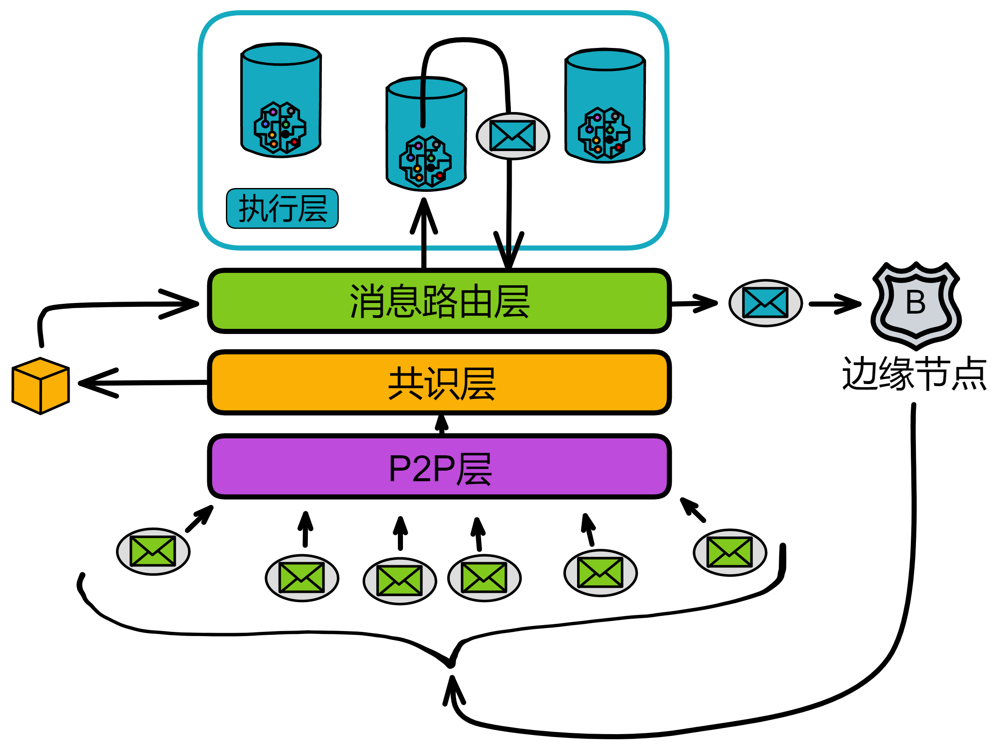
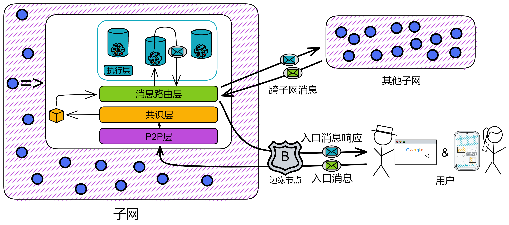
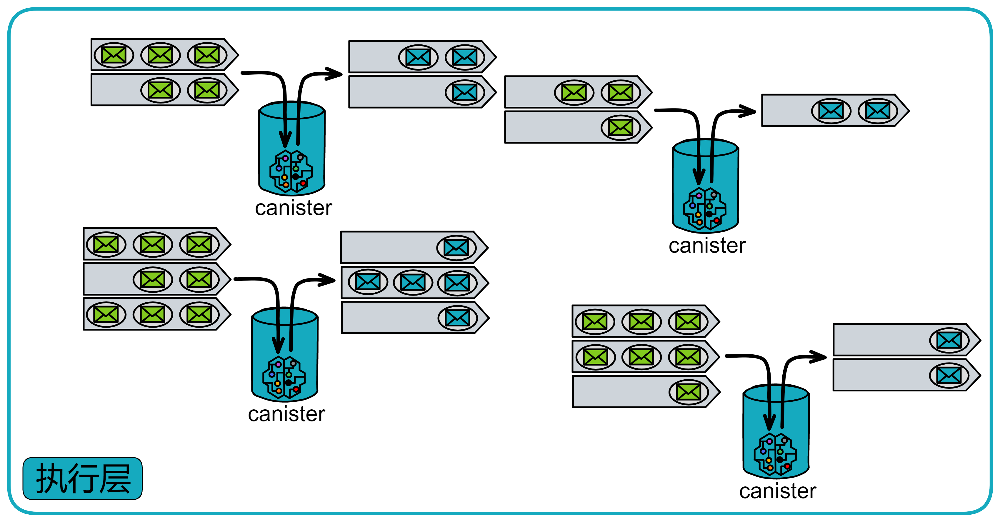
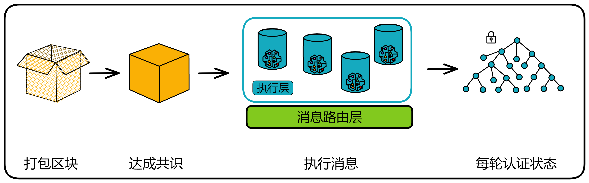
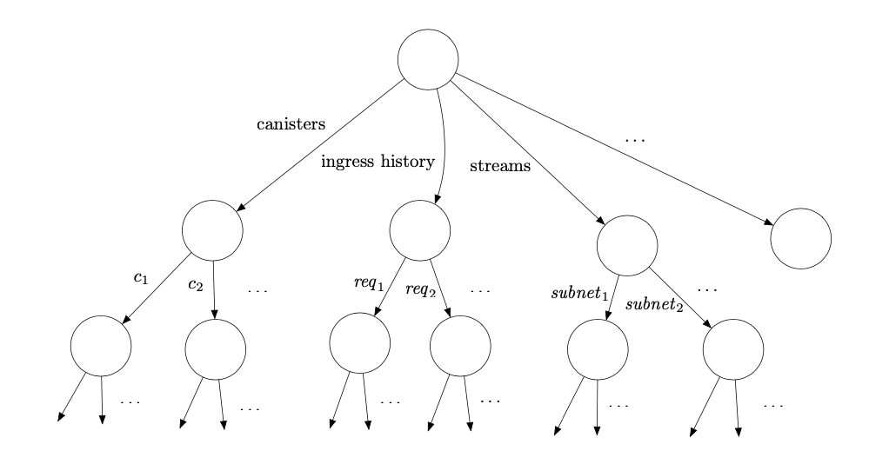
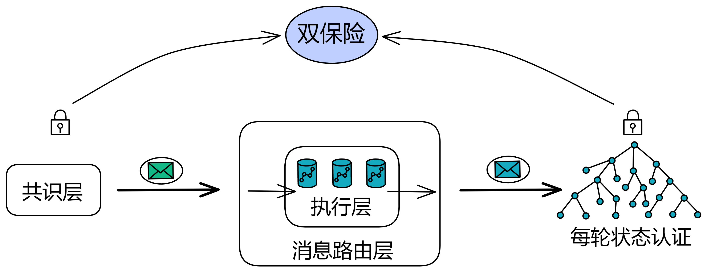

https://wiki.internetcomputer.org/wiki/IC_message_routing_layer

https://wiki.internetcomputer.org/wiki/IC_state_manager

# 消息路由层

## 副本内的消息收发站

消息路由层顾名思义，负责一个副本内部的消息传递，承上启下。

### 简介

共识层将消息打包进区块的**荷载**（payload）中，区块敲定之后。子网里的每个副本都会解析区块中的荷载，并由消息路由层将消息传递给执行层里对应的 canister 。Canister 执行完消息后，更新其内部状态，然后把消息响应交给消息路由层。

消息路由层**收到**的消息分两种：

一种是用户发来的消息，叫**入口消息**。另一种是其他子网的 canister 发的消息，叫**跨子网消息**。

消息路由层**发出**的消息也分两种：

一种是对用户消息的响应，叫**入口消息响应**。另一种还是**跨子网消息**，是自己子网的 canister 发送给其他子网里 canister 的消息。

### 消息队列

执行层的每个 canister 都有输入队列和输出队列。消息路由会把区块中的荷载路由到目标 canister 的输入队列中。

每个 canister 有自己一些**输入队列**和**输出队列**。

* **输入队列**：

    输入队列里有：来自用户的消息、其他子网里 canister 发的跨子网消息、子网内其他 canister 的消息。

    Canister 每轮都会执行一些输入队列中的消息，然后把消息响应放进 canister 的**输出队列**。

* **输出队列**：

    输出队列里有：对用户消息的响应、发给其他子网里 canister 的消息、发给子网内其他 canister 的消息。

    当消息路由层从消息队列中拿到消息后，把消息放进**子网间数据流**（subnet-to-subnet streams），然后由**跨子网传输协议**（crossnet transfer protocol）来负责将这些消息实际传输到其他子网中。

除了输出队列，还有一种**入口历史**（ingress history）的数据结构。它记录在一个叫 “ 每轮认证状态 ” 的[哈希树](ToDo：什么是哈希树、默克尔树，词汇表里写)里。入口历史只记录 canister 执行消息之后的响应。以便用户能获取自己消息的响应。

> 注意：入口历史并不保留所有入口消息的完整历史。只保留执行之后的响应消息。

我们把消息路由和执行层单独拿出来看，就是这样：

### 子网内跨 canister 调用

除了跨子网的消息外，也有 canister 调用同一子网内的另一个 canister 的消息，叫**子网内消息**（intra-subnet messages）。消息路由层会将这些消息从输出队列直接转到对应 canister 的输入队列中，不需要经过额外一轮的共识。

那为什么 canister 发给其他子网的消息要经过共识，而 canister 给子网内的消息不用经过额外的共识？

答：因为这种改变状态的操作都在子网内。😂

你想想，副本们里的数据状态都是一样的，共识也是为了保障副本们数据的一致性。那么副本们达成共识之后，各副本就会进行同样的操作。每个诚实的副本都会执行子网内的跨 canister 调用，大家一起执行跨 canister 的调用，这不还是保持一致的操作嘛。

共识是在大家面对各不相同的选择时，用来让大家统一执行操作的。

所以子网里的一个 canister 调用了另一个 canister 。也就是每个副本都会进行相同的跨 canister 调用。每个副本里存的数据都是这个子网里的全部数据。副本们都执行跨 canister 的调用，子网里任然保持着数据的一致性。

### 总结

这时候我们来总结一下，一个副本（子网的）的状态包括 canister 的状态和 “ 系统状态 ” 。 “ 系统状态 ” 包括了 canister 的输入输出队列、跨子网的数据流和入口历史的数据结构。

也就是说，消息路由层和执行层一起维护着一个副本的状态。而且副本的状态是在完全确定的情况下更新的，这样子网里所有的副本都保持着完全相同的状态。并且共识层不需要和消息路由层保持完全一致的进度。

## 每轮认证状态

每一轮次中，子网里每个副本的状态都会变更。

在每一轮变更的部分当然也需要单独记录。因为 IC 的共识只保证诚实的副本按照相同的顺序处理消息。共识只在消息进入执行层之前把关，但是消息处理之后的出口还缺少一个 “ 守卫 ” ：消息响应因为网络问题没有发送成功怎么办？客户端收到消息后，怎么验证消息真伪？万一消息响应是黑客伪造就麻烦了。万一服务器系统出现奇怪的 bug 导致消息没有执行 ...... 

副本之间需要在处理消息后，再最后核对一次状态。**每轮认证状态**（Per-round certified state，也叫系统状态树 The system state tree）就这个守卫，是一个完整轮次中的最后一环。每轮认证状态可以记录这一个轮次中副本改变的状态，并用再广播给大家做一次阈值签名，要经过三分之二的副本确认。

在每个轮次执行消息后，每个副本把自己生成的每轮认证状态哈希一下，打包为[默克尔树](词汇表)（Merkle Tree），并用私钥片段签名。收集够三分之二的签名片段，聚合为完整的签名，作为该轮次每轮认证状态的证书。

每轮认证状态包含这一轮次里的：

* 加入子网间数据流的跨子网消息
* 其他元数据，包括入口历史的数据结构
* 上一轮每轮认证状态默克尔树的根节点哈希

第一个分支存储了多种关于每一个容器的元数据（但不是容器的完整副本状态）。

第二个分支储存了入口历史的数据结构。

第三个分支储存了关于子网间数据流的信息，包括了对每个数据流新加入的跨子网消息的“视图”。

其他的分支存储了其他类型的元数据，这里不做讨论。该树状结构之后可被哈希计算为一棵默克尔树。

图4：每轮认证状态被组织成树

每轮状态认证在 IC 中有一下用例：

- **输出验证**。跨子网消息和入口消息响应可以利用每轮认证状态进行验证。使用默克尔树的结构，一个单独的输出（跨子网消息或是入口消息响应）可以被任一方通过提供根节点的阈值签名来验证，以及默克尔树中从根节点至叶节点的路径（以及相邻的）的哈希值。因此，验证一个单独输出的所需的哈希值数量与默克尔树的深度成比例，即使哈希树的尺寸非常大，该数值也通常非常小。因此，单个阈值签名可被有效的用于验证许多单独的输出。

- **防止并识别非确定性**。共识确保了每个节点按相同的顺序下处理输入。因为每个副本都确定性处理这些输入，每个副本都应取得相同的状态。

    但是，IC在设计上额外增加了一层健壮性来发现并阻止任何（意外的）非确定性计算，如果其真的发生。

    其中每轮认证状态是该机制中的一部分，因为我们使用了$(n-f)/n$的阈值签名来认证，且$f < n/3$，所以仅有单个状态序列可被认证。

    要理解状态成链为何如此重要，我们考虑如下的例子。假设我们有$P_1, P_2, P_3, P_4$四个节点副本，且其中一个副本$P_4$恶意。$P_1,P_2,P_3$起始状态都相同。

    -   在轮次1，由于非确定性计算，$P_1,P_2$均开始计算一条消息$m_1$以发送至子网A，而$P3$则计算$m'_1$以发送至子网A。

    -   在轮次2，$P_1,P_3$均开始计算消息$m_2$以发送至子网$B$，而$P2$则计算消息$m'_2$以发送至子网$B$ 

    -   在轮次3，$P_2,P_3$均开始计算消息m3以发送至子网C，而$P1$则计算消息$m'_3$以发送至子网$C$

如下表所示：

$$
P_1\ \ m_1 \rightarrow A\ \ m_2 \rightarrow B\ \ m'_3 \rightarrow C \\
P_2\ \ m_1 \rightarrow A\ \ m'_2 \rightarrow B\ \ m_3 \rightarrow C \\
P_3\ \ m'_1 \rightarrow A\ \ m_2 \rightarrow B\ \ m_3 \rightarrow C \\
$$
我们假设节点$P_1,P_2,P_3$各自执行有效序列的计算，但是因为非确定性，这些序列并不相同。（即使不应当存在任何的非确定性，我们在这个例子中依然假设其存在。）

现在假设我们没有将这些状态成链。因为$P_4$为恶意且可能签名任何内容，它可以在轮次1的状态中创建一个申明“$m_1\rightarrow A$”的$3/4$的阈值签名，类似得在轮次2的状态中申明”$m2\rightarrow B$“，并在轮次3状态中申明“$m3\rightarrow C$”，尽管对应的序列

$$
m_1	\rightarrow A, m_2 \rightarrow B, m_3 \rightarrow C
$$
可能不与**任何**有效的序列兼容。更糟糕的是，此无效的计算序列可能导致了其他子网的状态不一致。

通过成链，我们确保了即使存在一定程度的非确定性，任何经认证状态的序列都对应了一些由诚实节点执行的有效序列。

假设有4个副本，分别为 $P_1, P_2, P_3, P_4$，其中 $P_4$ 被设想为恶意副本。在开始时，$P_1$，$P_2$，和 $P_3$ 的状态都是相同的。

接下来的几个轮次中，每个副本会开始计算一些消息并将它们发送到不同的子网中，这些子网分别为 A、B 和 C。

* 但是，在轮次1中，$P_1$ 和 $P_2$ 开始计算消息 $m_1$，并且 $P_3$ 还计算了一个不同的消息 $m'_1$。
* 在轮次2中，$P_1$ 和 $P_3$ 开始计算消息 $m_2$，并且 $P_2$ 计算了不同的消息 $m'_2$。
* 最后，在轮次3中，$P_2$ 和 $P_3$ 开始计算消息 $m_3$，并且 $P_1$ 计算了不同的消息 $m'_3$。

因此，每个副本都计算了不同的消息，并且每个副本的状态序列也不相同。在这个例子中，我们假设存在一些非确定性计算，导致每个副本计算的消息和状态序列都不相同。

如果不考虑这个问题，副本 $P_4$ 可能会签名任何内容，因为它是一个恶意副本。

如果我们没有将状态成链，那么 $P_4$ 可能会：

* 在第一轮中签名一个声明“$m_1\rightarrow A$”的阈值签名，
* 而在第二轮中签名一个声明“$m_2\rightarrow B$”的阈值签名，
* 最后在第三轮中签名一个声明“$m_3\rightarrow C$”的阈值签名。

即使这些签名的消息序列是无效的，并且与任何有效的序列都不兼容，这个恶意副本仍然可以伪造签名。

通过将状态成链，我们可以确保任何已经经过认证的状态序列都与一些由诚实副本执行的有效序列相对应，即使存在某种程度的非确定性。这可以防止恶意副本利用它们的签名权利来伪造无效的状态序列，并防止不同子网的状态不一致。

共识层确保了副本按统一的顺序处理消息。但执行的时候还有可能被机器故障、系统的未知 bug 干扰，可能出现没有执行某条消息的情况 ...... 

所以为了确保每个副本对消息的处理没有问题，在 canister 执行消息之后，还得把已经执行完的消息记录下来，让副本们之间再核对一下

-   **与共识协作**。每轮认证状态也被用于与执行层和共识层协作，有如下两种方式：
    - *共识降速（Consensus throttling）*。每个节点都会跟踪存在认证状态的最新轮次—这被称之为**认证高度**。它也将跟踪存在经公证区块的最新轮次—这被称之为**公证高度**。如果公证高度明显大于认证高度，这是执行延迟于共识的信号，则共识需被降速。该延迟可能由非确定性计算或者由协议不同层中的性能不匹配导致。共识将通过[章节5.9](#5.9 延迟函数)中讨论的*延迟函数*进行降速—具体来说，每一个节点都会增加其*调节器*的数值$\epsilon$，作为公证高度与认证高度增长的时间间隔（这里用了[章节5.12.2](#5.12.2 本地化调整的延迟函数（Locally adjusted delay functions）)中提及的“本地化调整的延迟函数”的概念）。
    - *特定状态的荷载有效性验证（State-specific payload validation）*。如[章节5.7](#5.7 公证)所述，负载中的输入必须通过某些有效性检查。事实上，这些有效性检查可能取决于该状态的进度。我们略过的一个细节是，每个区块都包含一个轮次数，这些有效性检查应当考虑该轮次的验证后状态。一个需要执行验证的节点需要等待该轮次的状态被认证，然后使用该轮经认证的状态来进行验证。这么做确保了即使存在非确定性计算，所有的节点都在进行相同的有效性测试（否则共识可能会停滞）。

## 查询调用和更新调用

正如我们之前所述，所有的入口消息必须经过共识，才能被子网的所有节点副本按相同的顺序进行处理。但是，针对那些处理时不会变更状态的入口消息，可以进行一项重要的优化。他们被称为**查询调用**—而相对的其他入口消息，被称为**更新调用**。

查询调用被允许进行只读或是可能改变容器状态的计算，但是任何对副本状态的更新都不会被提交给复制状态。正因如此，查询调用可以被单个副本直接处理而不需要经过共识，这极大的降低了从查询调用获得响应的延迟。

需要注意的是，**查询调用的响应不会记录在入口历史的数据结构中，因此也不可以用之前的每轮认证状态进行验证**。

但是，我们提供了一种单独的用于验证该类响应的机制：**认证变量**（certied variables）。作为每轮认证状态中的一部分，每个子网下的容器都被分配了一小段字节，这便是该容器的认证变量，其值可通过更新调用进行更新，也可被每轮认证状态机制来进行验证。另外，容器也可使用其认证变量来存储默克尔树的的根节点。通过这种方式，只要查询调用的响应是该容器中以认证变量为根的默克尔树的叶节点，即可被验证。

## 外部用户验证

入口消息和跨子网消息的一个主要区别在于用于验证消息的机制。我们已经看到（详见[章节6.1](#6.1 每轮认证状态（Per-round certified state） )），聚合签名如何被用于验证跨子网消息。NNS的注册表（见[章节1.5](#1.5 权限模型)）持有用于验证跨子网消息的阈值签名的验证公钥。

IC中没有外部用户的中央注册表。相反，外部用户通过一串公钥哈希作为**用户标识**（又称*principal*）来向容器来标识自己。用户自己持有对应的签名密钥，用来签署入口消息。签名和公钥会随着入口消息一起发送。IC将自动验证签名并传递用户标识给到对应的容器。随后该容器根据用户标识和入口消息中指定操作的其他参数，批准请求的操作。

新用户在首次与IC交互时会生成一对密钥对并从公钥中衍生出他们的用户标识。老用户根据存储在用户代理中的私钥完成验证。用户还可以用签名委托的方式，将多个密钥对关联到一个用户身份上。该特性非常有用，因为它允许了一个用户在多个设备上通过相同的用户身份证明来访问IC。

